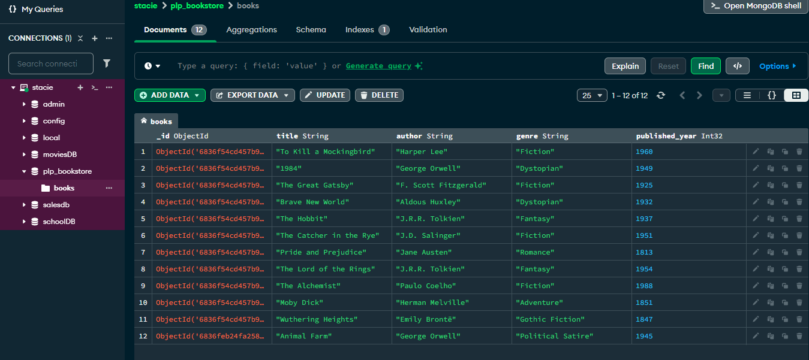

[](https://classroom.github.com/online_ide?assignment_repo_id=19655227&assignment_repo_type=AssignmentRepo)
# MongoDB Fundamentals Assignment

This assignment focuses on learning MongoDB fundamentals including setup, CRUD operations, advanced queries, aggregation pipelines, and indexing.

## Assignment Overview

You will:
1. Set up a MongoDB database
2. Perform basic CRUD operations
3. Write advanced queries with filtering, projection, and sorting
4. Create aggregation pipelines for data analysis
5. Implement indexing for performance optimization

## Getting Started

1. Accept the GitHub Classroom assignment invitation
2. Clone your personal repository that was created by GitHub Classroom
3. Install MongoDB locally or set up a MongoDB Atlas account
4. Run the provided `insert_books.js` script to populate your database
5. Complete the tasks in the assignment document

## Files Included

- `Week1-Assignment.md`: Detailed assignment instructions
- `insert_books.js`: Script to populate your MongoDB database with sample book data

## Requirements

- Node.js (v18 or higher)
- MongoDB (local installation or Atlas account)
- MongoDB Shell (mongosh) or MongoDB Compass

## Submission

Your work will be automatically submitted when you push to your GitHub Classroom repository. Make sure to:

1. Complete all tasks in the assignment
2. Add your `queries.js` file with all required MongoDB queries
3. Include a screenshot of your MongoDB database
4. Update the README.md with your specific setup instructions



## Setup Instructions

1. **Install Node.js**  
   Download and install Node.js (v18 or higher) from [nodejs.org](https://nodejs.org/).

2. **Install MongoDB**  
   - For local setup: Download and install MongoDB Community Server and MongoDB Compass from [mongodb.com](https://www.mongodb.com/try/download/community).
   - Or, create a free MongoDB Atlas account and cluster if you prefer a cloud database.

3. **Clone the Repository**  
   ```
   git clone <your-repo-url>
   cd week-1-mongodb-fundamentals-assignment-annastaciakagai
   ```

4. **Install Dependencies**  
   ```
   npm install mongodb
   ```

5. **Configure MongoDB Connection**  
   - If using MongoDB Atlas, update the connection string in `insert_books.js` to use your Atlas URI.
   - For local MongoDB, the default URI should work: `mongodb://localhost:27017`.

6. **Insert Sample Data**  
   Run the script to populate the database:
   ```
   node insert_books.js
   ```

7. **Run Queries**  
   - Open MongoDB Compass or use `mongosh` to connect to your database.
   - Copy and paste the queries from `queries.js` into the shell or Compass to test.


**Tip:**  
Adjust these steps if you made any custom changes (e.g., different database name, extra environment variables, etc.).


